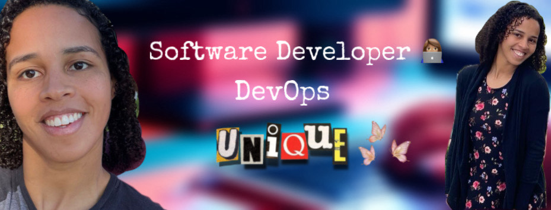

👋 Hey! I'm Thays, a software developer driven by technology and continuous improvement.

🚀 About Me
I'm committed to software development, exploring new technologies daily.

🌱 Key Skills
OS: Windows, Linux; 
Databases: MySQL, MongoDB, SQL; 
Languages: HTML, CSS, JavaScript (Node.js, TypeScript), Python, PHP, C, Java;
Frameworks/Libraries: React, Flask, Node Express, Android Studio;
Tools: Arduino, Docker, GitHub, VS Code, Tailwind.css, Vite.js;

📚 Learning Journey
I love learning and staying current with industry trends.

🌟 Why Work With Me?
 - Quick learner and problem solver
 - Collaborative and passionate about teamwork

🤝 Let's Connect
Excited to connect with developers and tech enthusiasts!
